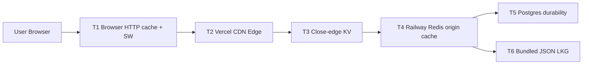

# Cache Tiers Decision Matrix (AGN-670)

- Status: Proposed
- Date: 2026-05-05
- Owner: [LEAD] CTO
- Scope: cache contract for runtime, APIs, and collector-backed data
- Related issues: AGN-618 (edge cache extend), AGN-625 (ETag), AGN-654 (sparse fields)
- Canonical read path: `src/lib/data-store.ts` + `refreshXxxFromStore()` readers

## Purpose

Define one authoritative cache contract across browser, edge, close-edge KV, origin Redis, Postgres, and bundled JSON LKG. This matrix is the source of truth for TTL and invalidation behavior; route 200 does not prove freshness.

## Tier diagram

## Matrix

| Tier | Layer | Data types stored | TTL policy | Invalidation triggers |
|---|---|---|---|---|
| T1 | Browser HTTP cache + optional SW | GET API payloads and static assets | Honor `Cache-Control` (`s-maxage`/`stale-while-revalidate` equivalent via browser semantics); SW policy must not exceed T2 freshness | URL/version change, ETag mismatch (AGN-625), hard reload, SW skipWaiting/activate |
| T2 | Vercel CDN edge | ISR HTML/RSC payloads and cacheable API GET responses | Route `revalidate` and API cache headers from `src/lib/api/cache.ts` | ISR revalidate window, on-demand revalidate, ETag change, deploy |
| T3 | Vercel KV / Cloudflare KV (close-edge) | Small derived snapshots safe for global replication (hot rankings, compact sidebar counters, sparse projections from AGN-654) | 30s to 10m depending on source cadence; never longer than source budget | Writer publish, key-version bump, explicit purge on incident |
| T4 | Railway Redis (origin cache source) | Canonical runtime payloads for shared sources (`trending`, mentions, skills, mcp, snapshots, etc.) | No mandatory expiry by default; freshness enforced by per-source budgets in freshness checks | Collector/worker `writeDataStore()` success, ops reset, key namespace migration |
| T5 | Postgres | Durable relational and event/audit data (profiles, auth/session-adjacent state, long-lived records) | Persistent; retention by table policy, not cache TTL | Row mutation, ETL, backfill, data correction |
| T6 | Bundled JSON LKG | Deploy-bundled fallback payloads under `data/*.json` | Valid only as fallback; treated stale unless proven fresh | New deploy bundle, explicit mirror write |

## Data type placement rules

1. Shared trend/source payloads: primary in T4, optional replication into T3, fallback in T6.
2. User/session/private data: never in T3/T6; keep in T5 plus request-scoped handling.
3. Public API reads: served through T2/T1 with cache headers; canonical freshness still comes from T4 state.
4. Sparse/compact payload variants (AGN-654): derive from T4 writes, cache in T3/T2, never become independent truth.

## Invalidations and ownership

- T4 is the operational freshness authority for source payloads.
- T2/T1 are delivery accelerators only.
- T6 is disaster/cold-start fallback only.
- Incident triage order: T4 freshness -> T2 headers/ISR -> T1 behavior.

## Code references

- `src/lib/data-store.ts`: T4 primary read/write with T6/T-memory fallback.
- `src/lib/data-store-reader.ts`: refresh dedupe/rate-limit path used by `refreshXxxFromStore()` readers.
- `src/lib/api/cache.ts`: T2 cache header profiles for API read routes.
- `src/app/**/page.tsx`: ISR `revalidate` values governing T2 HTML cache.

## Current verification note (this heartbeat)

- `npm run freshness:check` reached `http://localhost:3023` and failed on stale product state (`blocking_non_green=8`, `trending-repos=RED`).
- Classification: product freshness failure, not missing localhost server.
